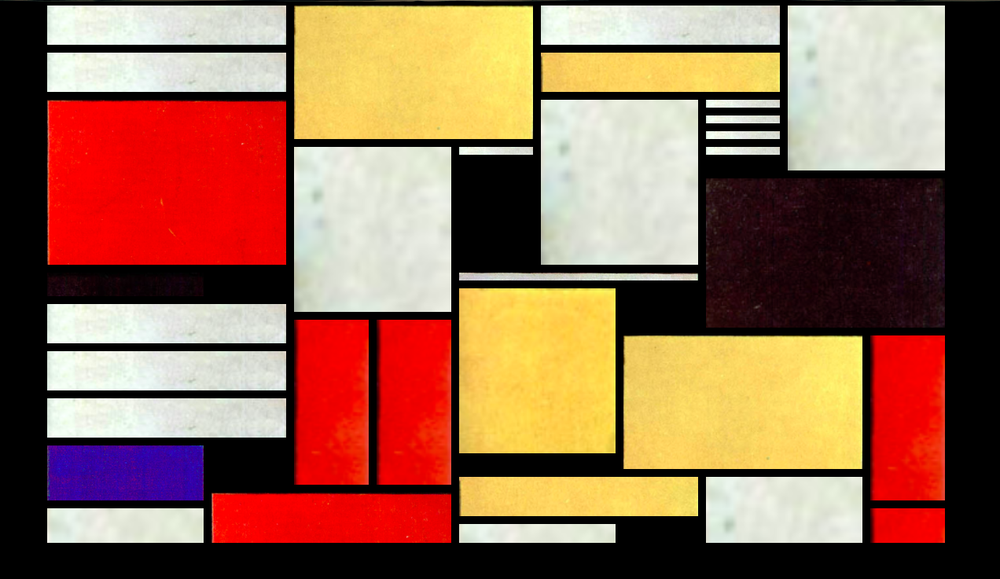
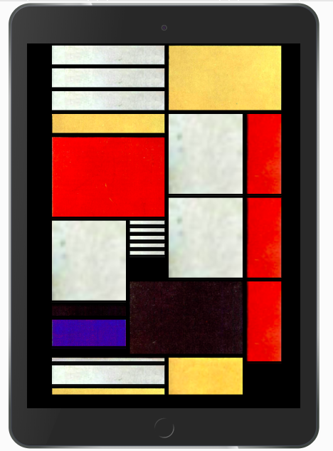
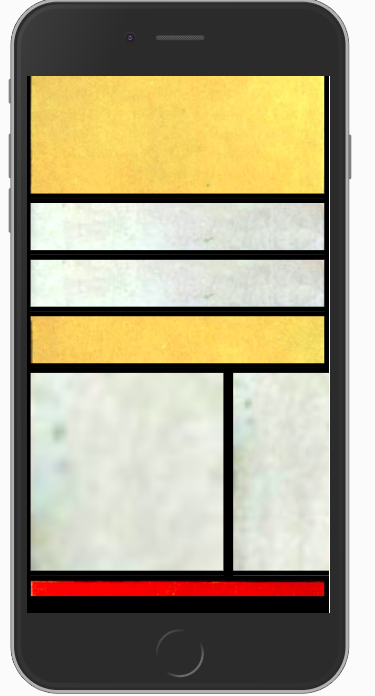

# mondrian-responsive

Little personnal project to learn how to use CSS grid.

## Visual

The result is available here : https://ebialais.github.io/mondrian-responsive/

## Acknowledgments
Thanks to Jen Simmons and her Youtube channel Layout Land.
